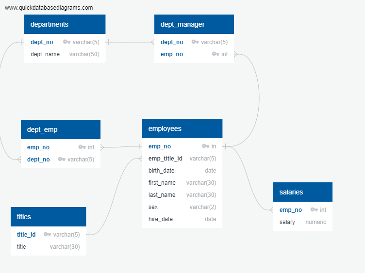

# sql_challenge

## Background 

It's been two weeks since you were hired as a new data engineer at Pewlett Hackard (a fictional company). Your first major task is to do a research project about people whom the company employed during the 1980s and 1990s. All that remains of the employee database from that period are six CSV files.

For this project, you'll design the tables to hold the data from the CSV files, import the CSV files into a SQL database, and then answer questions about the data. That is, you'll perform data modeling, data engineering, and data analysis, respectively.

## Approach

### Create database
```SQL
CREATE DATABASE sql-challenge;
```
### Create schema
To separate user tables from the system tables I create a schema separate from the public schema

```SQL
CREATE SCHEMA person;
```

### Create tables

To ensure that foreign keys do not fail during creation, start by creating the referenced tables first, followed by the referencing tables.

```SQL
-- Create tables without foreign keys first

CREATE TABLE person.departments (
    dept_no varchar(5) NOT NULL,
    dept_name varchar(50),
    CONSTRAINT PK_departments PRIMARY KEY (dept_no)
);

CREATE TABLE person.titles (
    title_id varchar(5) NOT NULL,
    title varchar(30),
    CONSTRAINT PK_titles PRIMARY KEY (title_id)
);

CREATE TABLE person.salaries (
    emp_no integer PRIMARY KEY,
    salary numeric
);

-- Create tables with foreign keys after referenced tables exist
CREATE TABLE person.employees (
    emp_no serial PRIMARY KEY,
    emp_title_id varchar(5),
    birth_date date,
    first_name varchar(30),
    last_name varchar(30),
    sex varchar(2),
    hire_date date,
    CONSTRAINT FK_employees_titles FOREIGN KEY (emp_title_id) REFERENCES person.titles (title_id),
    CONSTRAINT FK_employees_salaries FOREIGN KEY (emp_no) REFERENCES person.salaries (emp_no)
);

CREATE TABLE person.dept_emp (
    emp_no integer NOT NULL,
    dept_no varchar(5) NOT NULL,
    CONSTRAINT PK_dept_emp PRIMARY KEY (emp_no, dept_no),
    CONSTRAINT FK_dept_emp_employees FOREIGN KEY (emp_no) REFERENCES person.employees (emp_no),
    CONSTRAINT FK_dept_emp_departments FOREIGN KEY (dept_no) REFERENCES person.departments (dept_no)
);

CREATE TABLE person.dept_manager (
    dept_no varchar(5) NOT NULL,
    emp_no integer NOT NULL,
    CONSTRAINT PK_dept_manager PRIMARY KEY (dept_no, emp_no),
    CONSTRAINT FK_dept_manager_employees FOREIGN KEY (emp_no) REFERENCES person.employees (emp_no),
    CONSTRAINT FK_dept_manager_departments FOREIGN KEY (dept_no) REFERENCES person.departments (dept_no)
);
```
#### Entity Relationship Diagram
Here is the ERD for the tables created:


### Load Data
Use the COPY function to load data from CSV files into the tables in the same order that the tables were created.

```SQL
COPY person.departments (dept_no, dept_name) FROM 'PATH_TO_FILE/departments.csv' WITH (FORMAT CSV, HEADER true);
COPY person.titles(title_id, title) FROM 'PATH_TO_FILE\titles.csv' WITH (FORMAT CSV, HEADER true);
COPY person.salaries(emp_no, salary) FROM 'PATH_TO_FILE\salaries.csv' WITH (FORMAT CSV, HEADER true);
COPY person.employees(emp_no, emp_title_id, birth_date, first_name, last_name, sex, hire_date) FROM 'PATH_TO_FILE\employees.csv' WITH (FORMAT CSV, HEADER true);
COPY person.dept_emp(emp_no, dept_no) FROM 'PATH_TO_FILE\dept_emp.csv' WITH (FORMAT CSV, HEADER true);
COPY person.dept_manager(dept_no, emp_no) FROM 'PATH_TO_FILE\dept_manager.csv' WITH (FORMAT CSV, HEADER true);
```

## Analysis
* 1. List the employee number, last name, first name, sex and salary of each employee.
    ```SQL
    SELECT e.emp_no AS EmpNum, e.last_name As LastName, e.first_name AS FirstName, e.sex AS Sex, s.Salary
    FROM person.employees e INNER JOIN person.salaries s
    ON e.emp_no = s.emp_no
    ORDER BY salary desc
    ```
* 2. List the first name, last name and hire date for employees who were hired in 1986
    ```SQL
    SELECT first_name, last_name, hire_date
    from person.employees
    WHERE date_part('year', hire_date) = 1986
    ```
* 3. List the manager of each department along with their department number, department name, employee number, last name, and first name.
    ```SQL
    SELECT dm.dept_no, d.dept_name, dm.emp_no, e.last_name, e.first_name
    FROM person.dept_manager dm 
    INNER JOIN person.employees e ON dm.emp_no = e.emp_no
    INNER JOIN person.departments d ON dm.dept_no = d.dept_no
    ```
* 4.	List the department number for each employee along with that employee's employee number, last name, first name, and department name.
    ```SQL
    SELECT
        de.dept_no, e.emp_no, e.last_name, e.first_name, d.dept_name
    FROM person.employees e     
    INNER JOIN person.dept_emp de ON e.emp_no = de.emp_no
    INNER JOIN person.departments d ON de.dept_no = d.dept_no;
    ```
* 5.	List first name, last name, and sex of each employee whose first name is Hercules and whose last name begins with the letter B.
    ```SQL
    SELECT
        first_name, last_name, sex
    FROM person.employees
    WHERE
        first_name = 'Hercules'
        AND last_name LIKE 'B%';
    ```
* 6. List each employee in the Sales department, including their employee number, last name, and first name.
    ```SQL
    SELECT
        e.emp_no, e.last_name, e.first_name
    FROM person.employees e
    JOIN person.dept_emp de ON e.emp_no = de.emp_no
    JOIN person.departments d ON de.dept_no = d.dept_no
    WHERE d.dept_name = 'Sales';
    ```
* 7.	List each employee in the Sales and Development departments, including their employee number, last name, first name, and department name.
    ```SQL
    SELECT
        e.emp_no, e.last_name, e.first_name, d.dept_name
    FROM person.employees e
    JOIN person.dept_emp de ON e.emp_no = de.emp_no
    JOIN person.departments d ON de.dept_no = d.dept_no
    WHERE 
        d.dept_name IN ('Sales', 'Development');
    ```
* 8. List the frequency counts, in descending order, of all the employee last names (that is, how many employees share each last name).
    ```SQL
    SELECT
        last_name, COUNT(*) AS frequency
    FROM person.employees
    GROUP BY last_name
    ORDER BY frequency DESC;
    ```